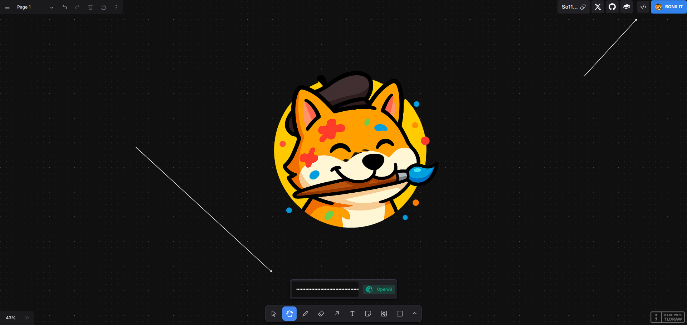
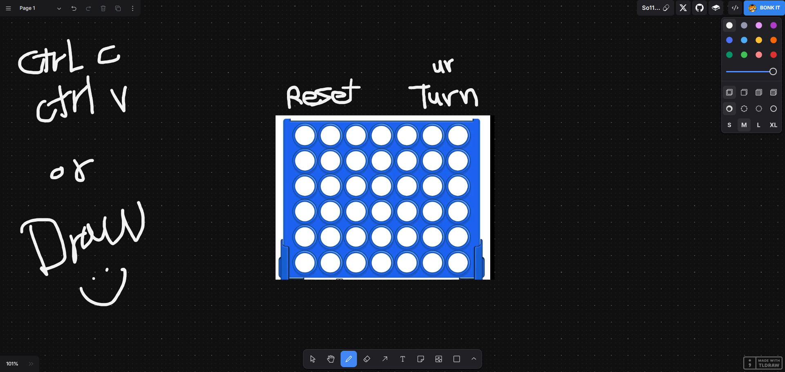
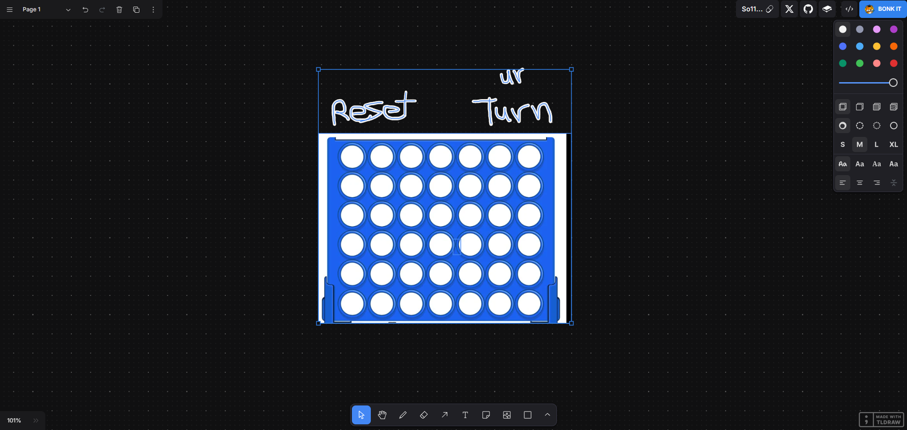
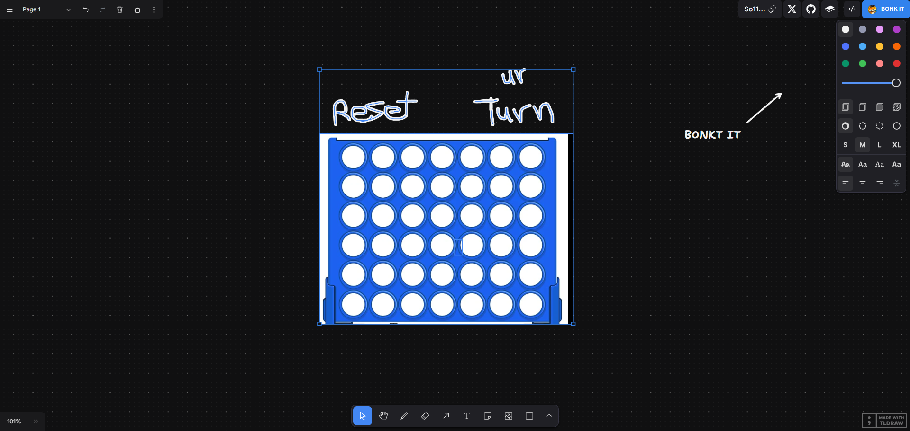
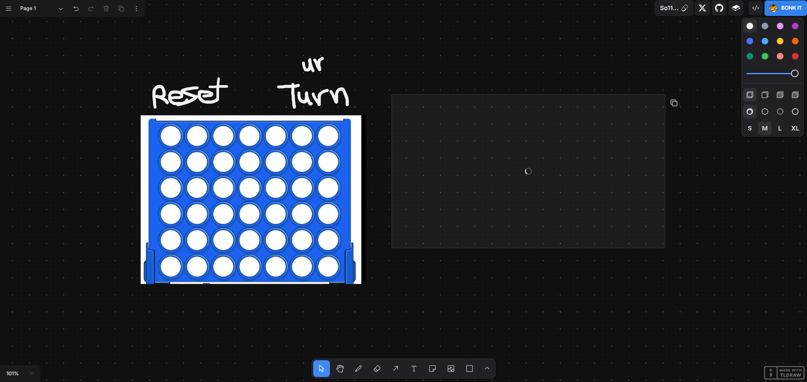
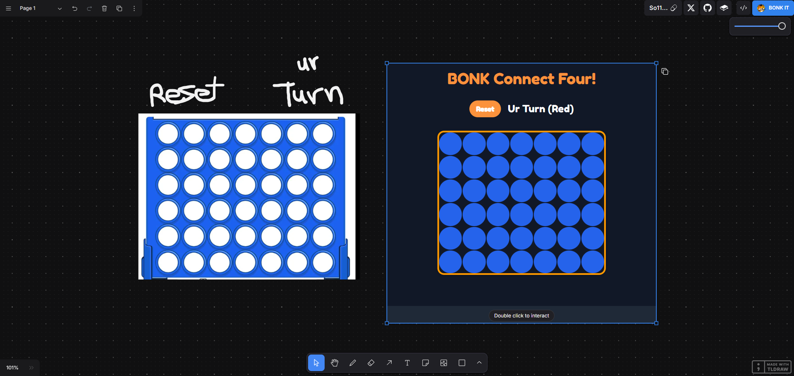
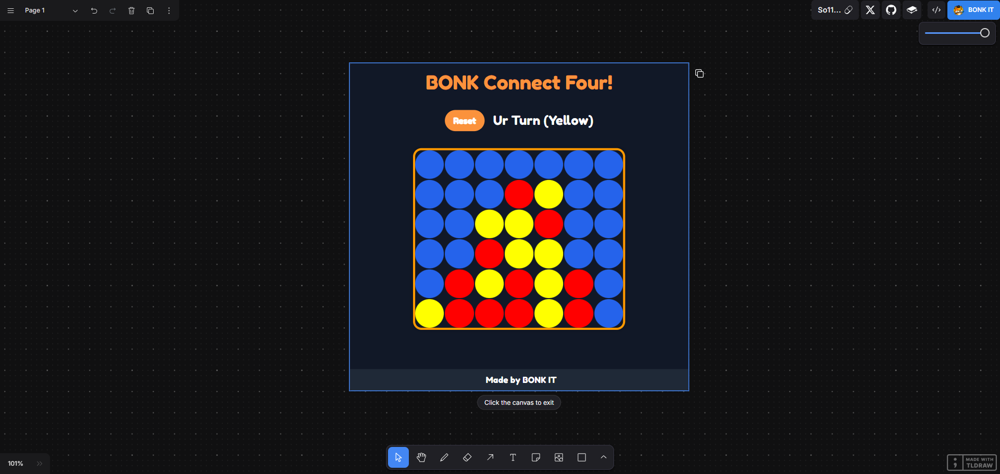

# BONK IT

CA: So11111111111111111111111111111111111111112 

Use this repo as a template to create interactive AI-powered applications. To get started:

1. Use the template and clone your new repo to your computer
2. Run `npm install` to install dependencies
3. Get a your API key from [https://aistudio.google.com/app/apikey](https://aistudio.google.com/app/apikey) or [https://platform.openai.com/api-keys](https://platform.openai.com/api-keys)
4. Paste your API key into the input box on the application interface
5. Run `npm run dev`
6. Open [localhost:3000](http://localhost:3000) and start creating!

## How do I use BONK IT?

⚠️ Before you start, you must first create and set up your API key.
import it by clicking the </> icon next to the BONK IT button. You can paste your OpenAI or Google AI API key into the input box—the system will detect which one you are using automatically.

1- Draw some stuff on the canvas.

2- Using the Select Tool (v), select the things you want to send to the AI.

3- Click the Bonk it button.

4- Wait for the magic to happen…

5- vua la!

6- Double click the result to interact with it.

## How it works?

BONK IT is built with the [tldraw SDK](https://tldraw.dev/), a very good
React library for creating whiteboards and other infinite canvas experiences.

To use it, first draw a mockup for a piece of UI. When you're ready, select the drawing, and press
the BONK IT button. We'll capture an image of your selection, and send it to the API provider along with instructions to turn it into a HTML file.

We take the HTML response and add it to a tldraw [custom
shape](https://tldraw.dev/docs/shapes#Custom-shapes). The custom shape shows the response in an
iframe so that you can interact with it on the canvas. If you want to iterate on the response,
annotate the iframe, select it all, and press 'Render' again.

## To make changes

To change how BONK IT works, start from the [`prompt.ts`](./app/prompt.ts) file. From there, you
can change the prompt that gets sent to Google AI Studio.

You can edit the `bonkIt` function in [`bonkIt.tsx`](./app/lib/bonkIt.tsx) to change what
happens when you hit the BONK IT button.

If you'd like BONK IT to create something other than HTML, you'll need to either update the
[`PreviewShape`](./app/PreviewShape/PreviewShape.tsx) to display something different, or use one of
tldraw's built-in shapes like image or text.

## The dangerous API key input method

For prototyping, we've also included the `RiskyButCoolAPIKeyInput`, Please use this as carefully and ethically as
you can, as users should be reluctant to add API keys to public sites.

## Core Workflow:

Users draw wireframes on the canvas using tldraw (an infinite canvas drawing tool)
When they select their drawing and click "Render", the app:
Captures a screenshot of the selected drawings
Extracts any text from the drawings
Sends this information to Gemini 1.5 along with a specialized prompt
Receives HTML code back that implements the drawn design

API Key Handling:
Users need to provide their own Google Studio AI key
The app includes a RiskyButCoolAPIKeyInput component where users can enter their API key
The key can be stored in two ways:
As an environment variable NEXT_PUBLIC_GOOGLEAI_API_KEY
In localStorage under bonkit_key

## Prompt System:

The system uses two main prompts (defined in prompt.ts):

- A detailed system prompt that instructs Gemini 1.5 to act as an expert web developer
- A user prompt that requests the conversion of wireframes to a working prototype

## Constraints and Features:

The AI is instructed to create self-contained HTML files
It can use certain external resources:
Tailwind CSS (via CDN)
JavaScript dependencies (via unpkg or skypack)
Google Fonts
Unsplash for images
The generated prototype should be:
Responsive
Interactive
High-fidelity (more polished than the wireframe)
Self-contained in a single HTML file

## Special Handling:

The system can understand and process:

Flow charts
Diagrams
Labels
Arrows
Sticky notes
Screenshots
Previous designs
Red annotations are treated specially - they're interpreted as instructions but not included in the final output

This is a powerful tool that allows designers to quickly convert their sketches into working prototypes using AI, bridging the gap between design and implementation.

## How do I get my API key?

To obtain your API key from Google AI Studio, follow these steps:
Sign in to your Google AI account at Google AI Studio.
Navigate to the "API Management" section within the dashboard.
Locate the "API Keys" tab and click on "Generate New Key."
Copy the generated API key and securely store it for use with BONK IT.
Make sure to keep your API key confidential and do not share it with unauthorized individuals.

